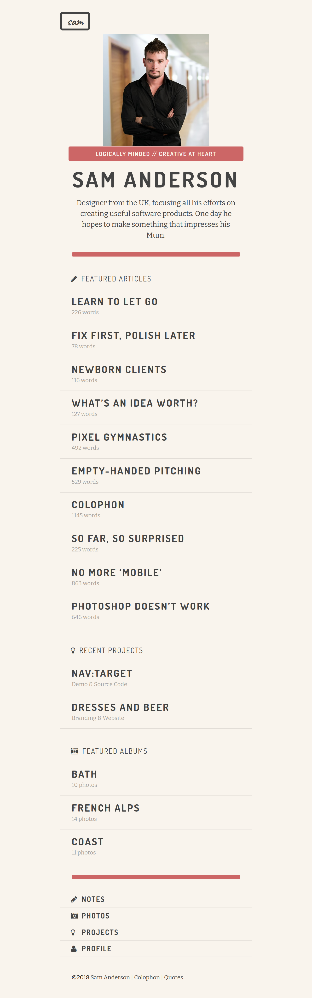

# Sam Anderson Portfolio

## Context
Sam Anderson has been working as a Graphic Designer in London for several years. He now plans to expand his work in and outside London by having a web presence that showcases his work. Sam has already designed the layout of his web page but needs help in scripting the markups and styles to realize the design.​

## Problem Statement
Sam had assigned this work to a local FrontEnd Developer, but the developer had some challenges and unfortunately could only produce the markup. Sam now needs help in styling the web page such that it gives a great user-experience to attract his customers.​

Style a web page available in `./index.html` to make it better readable and looks more attractive.​ **Sam wants his Portfolio to resemble the image given below.**


### Details
- There are 4 fonts which are widely used across the page and they can be found at following locations:
    - FontAwesome -  https://netdna.bootstrapcdn.com/font-awesome/3.2.1/css/font-awesome.css (icon-pencil, icon-user, icon-lightbulb, icon-camera-retro)
    - Caveat - https://fonts.google.com/specimen/Caveat
    - Dosis - https://fonts.google.com/specimen/Dosis
    - Bitter - https://fonts.google.com/specimen/Bitter
- Color Codes frequently used on the page
    - Light Gray - rgba(0,0,0,0.1)
    - Dark Gray - rgba(0,0,0,0.35)
    - [#c66](./c66.png)
    - [#F9F4ED](./f9f4ed.png) 
    - [#444](./444.png)
- Images used across the page
    - [City-Mountain-Sam](./city-sam-mountain.png)

### Tasks

- The boilerplate for this challenge contains index.html with HTML5 tags​
- As part of solution, the HTML elements should be styled using CSS3 style properties.​
- The solution for this practice can be developed in 3 stages:​​​​
    - Stage 1 :: Define styles in style.css file located in CSS folder of the boilerplate​​​​
    - Stage 2 :: Link the styles.css file with index.html​​ using <link> tag​​
    - Stage 3 :: Link the predefined stylesheets for fonts in index.html file​
    - Stage 3 :: Apply styles defined using class or id selector to the page elements​
- Below is the list of predefined stylesheets that need to be linked with index.html for formatting fonts
    ```
    - <link href="https://netdna.bootstrapcdn.com/font-awesome/3.2.1/css/font-awesome.css" rel="stylesheet">​
    - <link rel="preconnect" href="https://fonts.gstatic.com">​
    - <link href="https://fonts.googleapis.com/css2?family=Caveat:wght@700&display=swap" rel="stylesheet">​
    - <link rel="stylesheet" href="https://fonts.googleapis.com/css?family=Dosis:400,700%7CBitter:400,400italic,700&subset=latin,latin">​
    
    ```
​